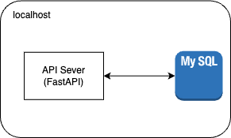

# UploadAudioSampleAPI

## Description

This API can upload audio `m4a` files to mysql database in local server. the audio files will be stored in the database as `wav` format.



## Setup

- install docker-compose

## Usage

1. Run container

   ```bash
   docker-compose up
   # or docker-compose up --build
   ```
